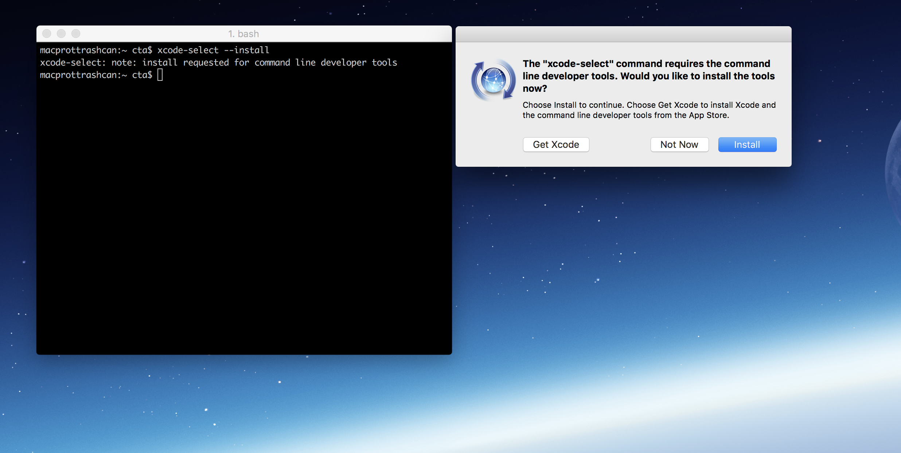
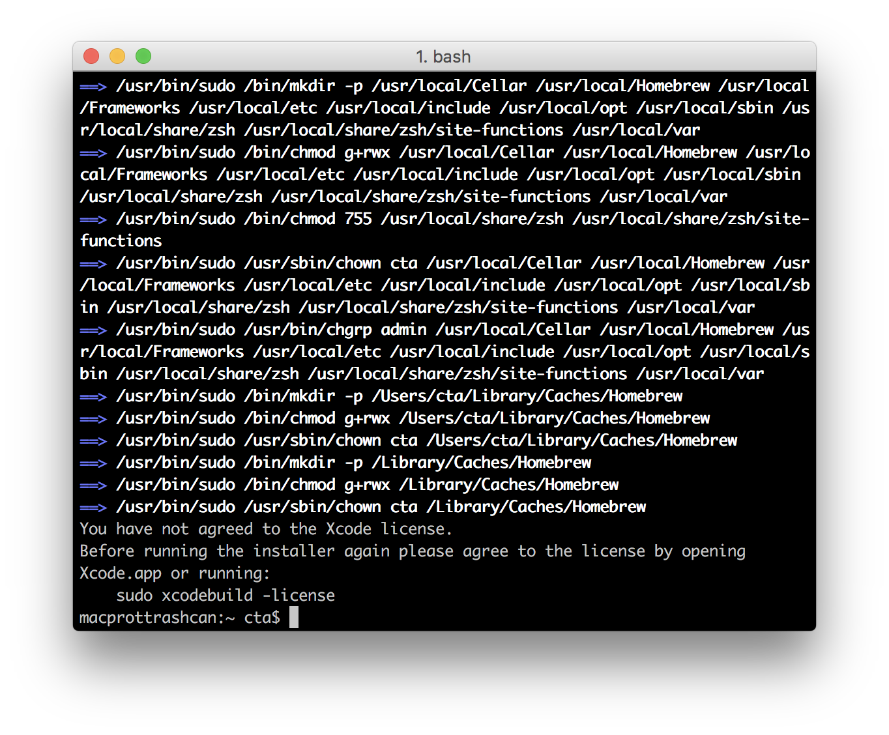

## text processing pre-flight

Below are instructions regarding installing things needed to participate in this workshop. They include:

* [Xcode](https://developer.apple.com/xcode/) (Command Line Tools)
* [Homebrew](http://brew.sh/)
* [Python3](https://www.python.org/)
* [PyPI](https://pypi.python.org/pypi)
* [iPython3](https://ipython.org/install.html)
* [BeautifulSoup4](https://www.crummy.com/software/BeautifulSoup/)
* [Natural Language Toolkit](http://www.nltk.org/)

### Xcode / The Command Line Tools

Do you have Xcode? To check go to the terminal and execute `xcode-select -p`.

* If `/Applications/Xcode.app/Contents/Developer` (or something similar) appears as a response proceed to the next step.
* If anything else happens download and install `Xcode` from [here](https://itunes.apple.com/us/app/xcode/id497799835?mt=12) before moving on.

Enter `xcode-select --install` into the terminal, which should result in something like this:

Click `Install` to download and install the `Xcode Command Line Tools` (it takes a while so maybe go make some food or get a cup of coffee or something).

### Homebrew

Copy and paste this code into the terminal and press `enter` to install [homebrew](http://brew.sh/):  `/usr/bin/ruby -e "$(curl -fsSL https://raw.githubusercontent.com/Homebrew/install/master/install)"`

If prompted, agree to the Xcode license

by executing `sudo xcodebuild -license` in the terminal.

Search to see if something is available on `homebrew` with `search`. For example:  `brew search python3`

### Python3

To install Python 3 (**not Python 2**) execute `brew install python3` in the terminal.

### PyPI

PyPi is frequently referred to as `pip`. It is used to manage Python library installations and ships with `Python3` when installed via `Homebrew`. The command to use it is `pip3`, **not** pip.

Search for something on `pip` with the `search` command. For example: `pip3 search ipython`

### iPython

Install `iPython` via `pip`: `pip3 install ipython`

executing `ipython3` in the terminal starts the [IDE](https://en.wikipedia.org/wiki/Integrated_development_environment).

### BeautifulSoup4

`pip3 install beautifulsoup4`

### Natural Language Toolkit

`sudo pip3 install -U nltk`

Confirm that it works with the following steps (all in the terminal):

1. `ipython3`
2. `import nltk`
3. `nltk.` <and then hit the TAB key>

### NLTK Things

Run `iPython`, import the `NLTK` library, then run the downloader in the following steps:

1. `ipython3`
2. `import nltk`
3. `nltk.download()`

It should look like this in the terminal prior to launching the downloader:

Then select `book` and click `Download`:

